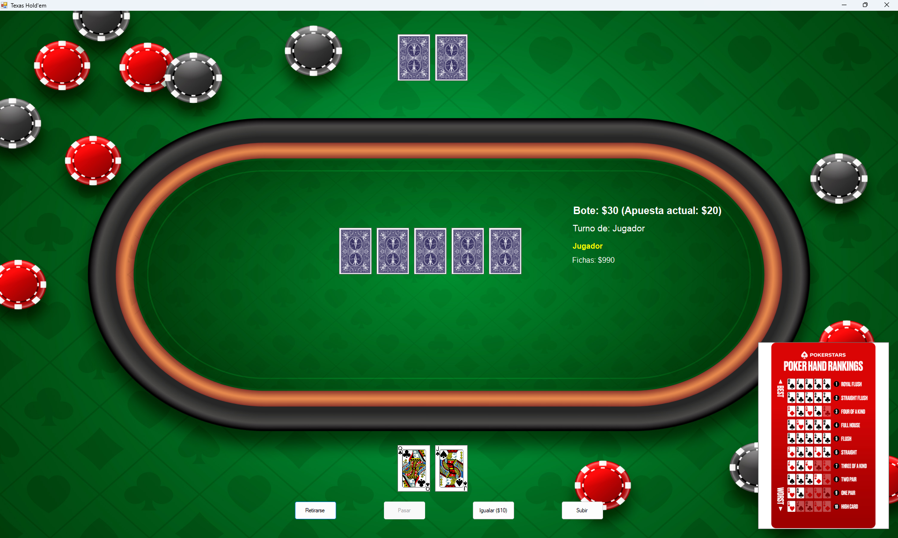
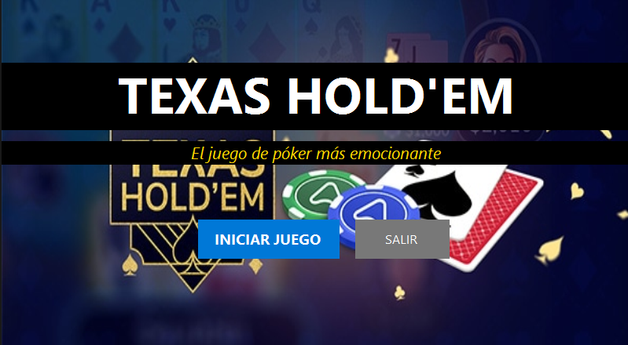

# 🃏 Texas Hold'em - Juego de Póker

;

<!-- Agrega aquí una captura de pantalla del juego en funcionamiento -->

## 📋 Descripción

Texas Hold'em es una aplicación de escritorio desarrollada en C# con Windows Forms que permite jugar al popular juego de póker Texas Hold'em contra una inteligencia artificial. El juego incluye todas las mecánicas básicas del póker: apuestas, fases del juego (Pre-Flop, Flop, Turn, River), evaluación de manos y sistema de fichas.

## ✨ Características Principales

- 🎮 **Juego completo de Texas Hold'em** con todas las reglas estándar
- 🤖 **Oponente IA** con lógica de decisión inteligente
- 💾 **Sistema de usuarios** con base de datos MySQL para registro y login
- 🎯 **Evaluación de manos** completa (Par, Trío, Escalera, Color, Full House, Póker, Escalera de Color)
- 💰 **Sistema de fichas** persistente por usuario
- 🎨 **Interfaz gráfica moderna** con cartas visuales y animaciones
- 📊 **Guía de rankings** integrada para principiantes
- 🔒 **Seguridad** con hash SHA256 para contraseñas

## 🚀 Requisitos del Sistema

- Windows 7 o superior
- .NET Framework 4.7.2 o superior
- MySQL Server 5.7 o superior (para funcionalidad de usuarios)
- Visual Studio 2017 o superior (para desarrollo)

## 📦 Instalación

### 1. Clonar el repositorio
```bash
git clone https://github.com/tu-usuario/TexasHoldem.git
cd TexasHoldem
```

### 2. Instalar dependencias
- Abre el proyecto en Visual Studio
- Restaura los paquetes NuGet (MySql.Data)
- O ejecuta: `Update-Package -reinstall`

### 3. Configurar MySQL
- Instala MySQL Server
- Ejecuta el script `database_setup.sql` o deja que la aplicación lo cree automáticamente
- Configura las credenciales en `DatabaseManager.cs`

### 4. Compilar y ejecutar
- Compila el proyecto en Visual Studio (F5)
- O ejecuta `TexasHoldem.exe` desde `bin/Debug/`

## 🎮 Cómo Jugar

1. **Iniciar Sesión**: Al abrir la aplicación, inicia sesión con tu cuenta o regístrate si es la primera vez
2. **Iniciar Partida**: Haz clic en "INICIAR JUEGO" en la pantalla de inicio
3. **Jugar**: 
   - Toma decisiones en tu turno: Retirarse, Pasar, Igualar o Subir
   - Observa las cartas comunitarias que se revelan en cada fase
   - Gana el bote con la mejor mano o haciendo que tu oponente se retire
4. **Ganar**: El ganador se determina por la mejor mano de 5 cartas o por retirada del oponente

## 🎯 Reglas del Juego

### Fases del Juego
- **Pre-Flop**: Se reparten 2 cartas a cada jugador
- **Flop**: Se revelan 3 cartas comunitarias
- **Turn**: Se revela la 4ta carta comunitaria
- **River**: Se revela la 5ta carta comunitaria
- **Showdown**: Se comparan las manos finales

### Ranking de Manos (de mayor a menor)
1. **Escalera de Color** - 5 cartas consecutivas del mismo palo
2. **Póker** - 4 cartas del mismo valor
3. **Full House** - Trío + Par
4. **Color** - 5 cartas del mismo palo
5. **Escalera** - 5 cartas consecutivas
6. **Trío** - 3 cartas del mismo valor
7. **Dos Pares** - 2 pares diferentes
8. **Par** - 2 cartas del mismo valor
9. **Carta Alta** - La carta más alta

## 🛠️ Tecnologías Utilizadas

- **C#** - Lenguaje de programación
- **Windows Forms** - Framework de interfaz gráfica
- **MySQL** - Base de datos para usuarios
- **MySql.Data** - Conector MySQL para .NET

## 📁 Estructura del Proyecto

```
TexasHoldem/
├── assets/              # Imágenes y recursos (cartas, fondos)
├── Properties/          # Configuraciones del proyecto
├── AIPlayer.cs          # Lógica de la IA
├── Card.cs              # Clase de carta
├── Deck.cs              # Clase de mazo
├── GameEngine.cs        # Motor principal del juego
├── HandEvaluator.cs     # Evaluación de manos de póker
├── DatabaseManager.cs   # Gestión de base de datos
├── LoginForm.cs         # Formulario de inicio de sesión
├── RegisterForm.cs      # Formulario de registro
├── MesaDeJuegoForm.cs   # Formulario principal del juego
├── Player.cs            # Clase de jugador
├── SplashForm.cs        # Pantalla de inicio
└── Program.cs           # Punto de entrada
```

## 🔧 Configuración

### Base de Datos MySQL
Edita `DatabaseManager.cs` para configurar tu conexión:
```csharp
string server = "localhost";
string database = "texasholdem_db";
string uid = "root";
string password = "tu_contraseña";
```

## 📝 Características Técnicas

- **Arquitectura**: Aplicación de escritorio con separación de lógica y UI
- **Patrones**: Event-driven, Observer pattern para eventos del juego
- **Seguridad**: Hash SHA256 para contraseñas, parámetros preparados para prevenir SQL injection
- **Rendimiento**: Caché de imágenes, doble buffer para animaciones suaves

## 🎨 Capturas de Pantalla

<!-- Agrega aquí capturas de pantalla del juego -->


## 🤝 Contribuir

Las contribuciones son bienvenidas. Por favor:
1. Fork el proyecto
2. Crea una rama para tu feature (`git checkout -b feature/AmazingFeature`)
3. Commit tus cambios (`git commit -m 'Add some AmazingFeature'`)
4. Push a la rama (`git push origin feature/AmazingFeature`)
5. Abre un Pull Request

## 📄 Licencia

Este proyecto está bajo la Licencia MIT - ver el archivo LICENSE para más detalles.

## 👨‍💻 Autor

**Tu Nombre**
- GitHub: [@tu-usuario](https://github.com/tu-usuario)

## 🙏 Agradecimientos

- Imágenes de cartas de dominio público
- Comunidad de desarrolladores de póker
- Documentación de MySQL y .NET Framework

---

⭐ Si te gusta este proyecto, ¡dale una estrella en GitHub!

